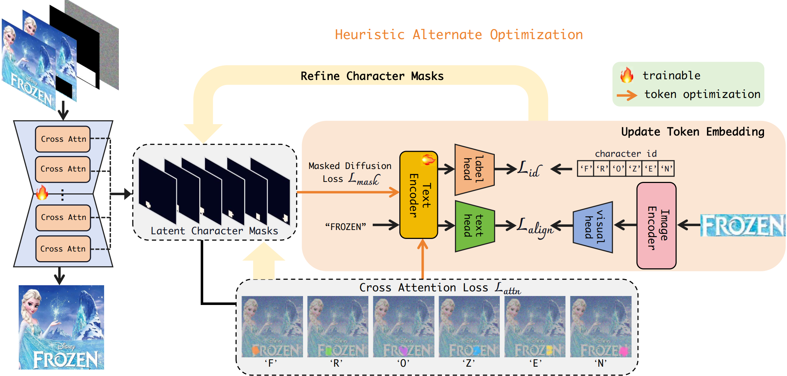
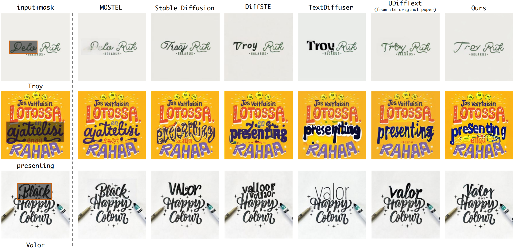

# High Fidelity Scene Text Synthesis

Official implementation of [High Fidelity Scene Text Synthesis](https://arxiv.org/pdf/2405.14701).

## Abstract
Scene text synthesis involves rendering specified texts onto arbitrary images. Current methods typically formulate this task in an end-to-end manner but lack effective character-level guidance during training. Besides, their text encoders, pre-trained on a single font type, struggle to adapt to the diverse font styles encountered in practical applications. Consequently, these methods suffer from character distortion, repetition, and absence, particularly in polystylistic scenarios. To this end, this paper proposes DreamText for high-fidelity scene text synthesis. Our key idea is to reconstruct the diffusion training process, introducing more refined guidance tailored to this task, to expose and rectify the model's attention at the character level and strengthen its learning of text regions. This transformation poses a hybrid optimization challenge, involving both discrete and continuous variables. To effectively tackle this challenge, we employ a heuristic alternate optimization strategy. Meanwhile, we jointly train the text encoder and generator to comprehensively learn and utilize the diverse font present in the training dataset. This joint training is seamlessly integrated into the alternate optimization process, fostering a synergistic relationship between learning character embedding and re-estimating character attention. Specifically, in each step, we first encode potential character-generated position information from cross-attention maps into latent character masks. These masks are then utilized to update the representation of specific characters in the current step, which, in turn, enables the generator to correct the character's attention in the subsequent steps. Both qualitative and quantitative results demonstrate the superiority of our method to the state of the art.

